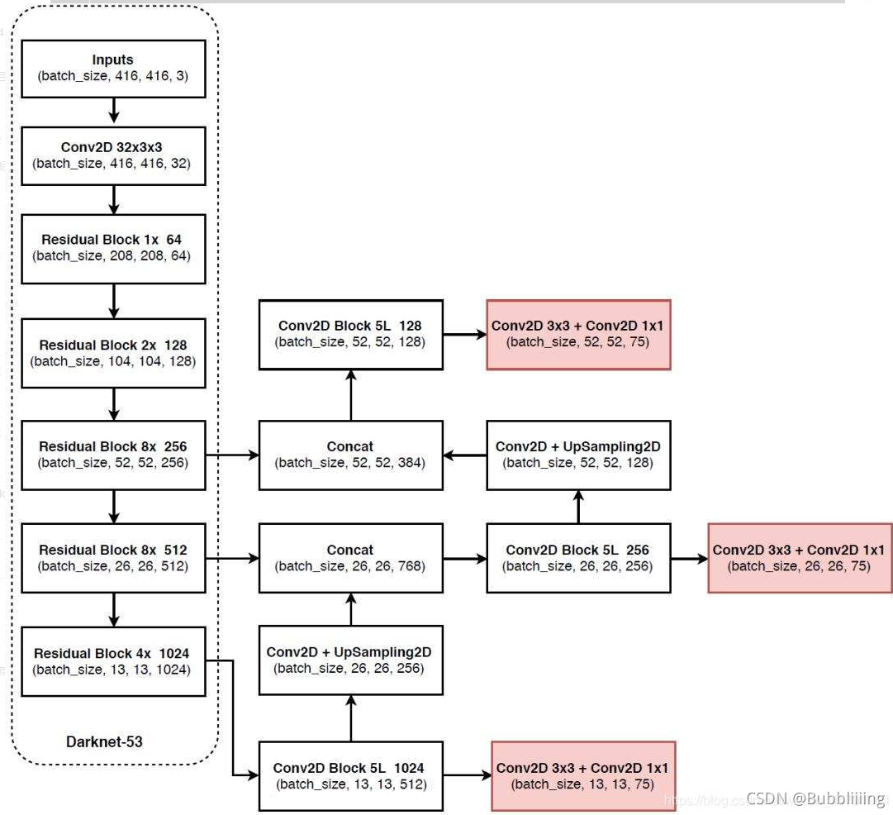
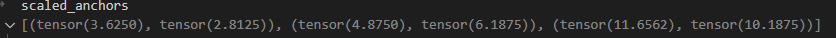
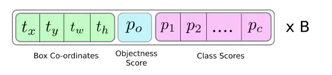
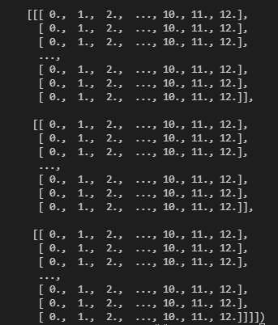
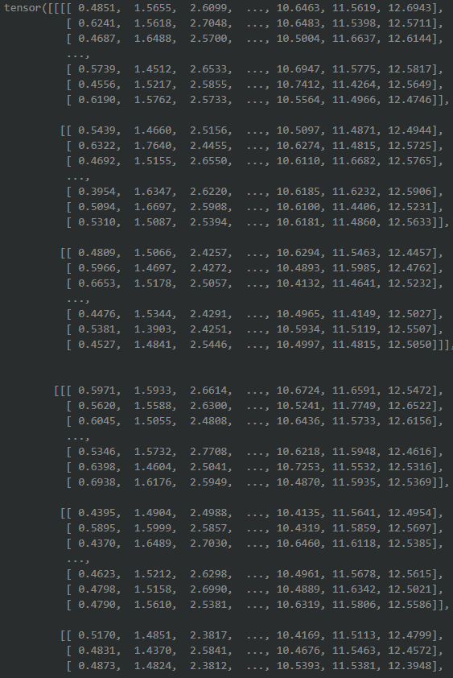

# [YoloV3](https://blog.csdn.net/weixin_44791964/article/details/105310627)



## 1 特征提取

### 1.1 特征提取网络（DarkNet53）

> [batch_size, 416, 416,3]

> Conv2D 32*3*3 [batch_size, 416,416,32]

> Residual Block 1 * 64 [batch_size, 208, 208, 64]

> Residual Block 2 * 128 [batch_size, 104, 104, 128]

> Residual Block1 8 * 256 [batch_size, 52, 52, 256]

> Residual Block2 8 * 512 [batch_size, 26, 26, 512]

> Residual Block3 8 * 512 [batch_size, 13, 13, 1024]

### 1.2 获取预测结果

该过程开业分为两部分，分别是构建FPN特征金字塔进行加强特征提取和利用YoloHead对三个有效特征层进行预测。

#### 1.2.1 构建FPN特征金字塔进行加强特征提取

在特征利用部分，YoloV3提取**多特征层**进行目标检测，一共提取了三个。
提取的是DarkNet53的中间层、中下层和底层。（此处不能解释为倒数三层，因为其中很多重复的层）。
```python
ResidualOut3.shape = [batch_size, 52, 52, 256]
ResidualOut4.shape = [batch_size, 26, 26, 512]
ResidualOut5.shape = [batch_size, 13, 13, 1024]
```
##### 构建方式

- **ResidualOut5**特征层进行5次卷积，处理完后，一边利用YoloHead获得预测结果；另一方面进行上采样，UpSampling2d，与**ResidualOut4**进行拼接，得到[batch_size, 26, 26, 768]
- 结合后（[batch_size, 26, 26, 768]）的特征层再进行5次卷积，一边利用YoloHead获得预测结果，另一方面进行上采样，结果与**ResidualOut3**进行结合。
- 将结合后的**ResidualOut3**，进行5次卷积处理，处理完后利用YoloHead获得预测结果。

##### 利用Yolo Head对三个有效的特征层进行预测

- 利用FPN特征金字塔，可以获得三个加强特征，并传入yolohead进行处理。
  - [13, 13, 75]
  - [26, 26, 75]
  - [52, 52, 75]
- 其中，75表示：
  - 他的类有20种，1个维度表示是否有物体，4个维度表示坐标， 25=20+1+4。 YoloV3针对每一个特征层的每一个特征点，存在3个先验框，所以 75 = 3*25。
  - 如果种类有80个，则维度为85*3 = 255。

## 2  解码

4+1+20分别表示：

- x_offset
- y_offset
- h
- w
- 置信度
- 分类结果

但是，这个结果并不会对应最终的预测框在图片上的位置，还需要解码才能完成。

得到的最终预测结果还要进行**得分排序和非极大值抑制**进行筛选。

### 2.1 输入

解码的输入为第3部分输出，一共3个，大小分别为：

- [batch_size, 13, 13, 75]
- [batch_size, 26, 26, 75]
- [batch_size, 52, 52, 75]

对每一个结果，都要分别执行操作。

### 2.2 解码过程

#### 2.2.1 将提取的特征转换为锚点和宽高的表示法

- 获取输入部分的batch_size，长和宽，由于torch中使用的是batch_size, channel, height, weight

```python
batch_size   = input.size(0)
input_height = input.size(2)
input_width  = input.size(3)
```

- 求步长：将原始图像分为13*13的大小，每个块的长和宽就是步长。

```python
stride_h = self.input_shape[0] / input_height
stride_w = self.input_shape[1] / input_width
```

- 获取在该input.shape下，一个先验框包含的格子（非13*13这种，而是stride_h,stride_w）数目

```python
scaled_anchors = [(anchor_width / stride_w, anchor_height / stride_h) for anchor_width, anchor_height in self.anchors[self.anchors_mask[i]]]
```



- 将input（input是获取的一个特征，包含种类，是否有物体和坐标信息）变为prediction。prediction的大小为[batch_size, 3, 25, 13,13]。input的大小为[batch_size, 75, 13, 13]。同时，将特征信息维度，即25，放置到最后，方便特征的分解。

```python
prediction = input.view(batch_size, len(self.anchors_mask[i]), self.bbox_attrs, input_height, input_width).permute(0, 1, 3, 4, 2).contiguous()
```

- 特征分解
  - 25=4+1+20（4：先验框中心x,y，先验框h,w；1：是否有物体；20：种类）。


$$
x = \sigma(t_x) + C_x
$$

$$
y = \sigma(t_y)+C_y
$$

$$
w = C_w * e^{t_w}
$$

$$
h = C_h*e^{t_h}
$$

```python
x = torch.sigmoid(prediction[..., 0]) 
y = torch.sigmoid(prediction[..., 1])
w = prediction[..., 2]
h = prediction[..., 3]

conf        = torch.sigmoid(prediction[..., 4])
pred_cls    = torch.sigmoid(prediction[..., 5:])
```

- 生成网格-先验框，以左上角为基准。
  - <font color=red>该部分主要是为了计算，原图划分为13*13后，每一个块左上角的顶点的值。 </font> 
  - linspace（下限，上限，段数）：将下限-上限分为x段，每段等长，返回一维tensor。
  - repeat(x,y)：将第一个维度重复x次，第2个维度重复y次。
  - view：最后将生成的矩阵，与x的大小变为一致。
  - t()：转置，0-12由横向变为竖向。

```python
grid_x = torch.linspace(0, input_width - 1, input_width).repeat(input_height, 1).repeat(batch_size * len(self.anchors_mask[i]), 1, 1).view(x.shape).type(FloatTensor)
grid_y = torch.linspace(0, input_height - 1, input_height).repeat(input_width, 1).t().repeat(batch_size * len(self.anchors_mask[i]), 1, 1).view(y.shape).type(FloatTensor)
```




- 生成先验框的宽高
  - <font color=red>生成实际框的宽和高（以步长为单位）</font>
  - 根据代码，计算结果应当是一个数据的重复，宽为一个数，高位一个数。
  - w和h的shape = [batch_size, 13, 13]。即，每个块的宽和高都可以找到对应的值，而且一致。

```python
anchor_w = FloatTensor(scaled_anchors).index_select(1, LongTensor([0]))
anchor_h = FloatTensor(scaled_anchors).index_select(1, LongTensor([1]))
anchor_w = anchor_w.repeat(batch_size, 1).repeat(1, 1, input_height * input_width).view(w.shape)
anchor_h = anchor_h.repeat(batch_size, 1).repeat(1, 1, input_height * input_width).view(h.shape)
```

- 利用预测结果对先验框进行调整
  - pred_boxes.shape = [batch_size, 13,13, 4]
  - <font color=red>grid_x和grid_y表示的是某个块左上角的顶点，而x和y表示的是经过sigmoid计算后的结果，该结果在0-1之间，保证偏移后不会超出当前框</font>
  - w和h的数据可能会出现负数，用$e^w$计算，在计算乘法时，不会出现宽和高为负数的情况。
  - 运算结果如下图所示，锚点均处于当前的框内

```python
pred_boxes = FloatTensor(prediction[..., :4].shape)
pred_boxes[..., 0]  = x.data + grid_x
pred_boxes[..., 1]  = y.data + grid_y
pred_boxes[..., 2]  = torch.exp(w.data) * anchor_w
pred_boxes[..., 3]  = torch.exp(h.data) * anchor_h
```



- 将输出归一化位小数，并将结果进行拼接。
  - 归一化原因：
    - 可能是在之前计算中使用了sigmoid和exp，会使数据出现一定的变化，现在直接进行归一化，可以抵消该变化。

```python
_scale = torch.Tensor([input_width, input_height, input_width, input_height]).type(FloatTensor)
output = torch.cat((pred_boxes.view(batch_size, -1, 4) / _scale, conf.view(batch_size, -1, 1), pred_cls.view(batch_size, -1, self.num_classes)), -1)
```

#### 2.2.2 提取结果

提取完成后，输出为[x,y,w,h,1,class]

其中，x,y表示该框的中心。w,h表示该框的实际宽高。1的位置表示置信度。class表示该框中物体属于各个类的概率。


### 2.3 非极大值抑制

非极大值抑制，可以消除标注为同类的框。

在解码过程中，认为，同类的框才需要抑制，非同类的不需要。

参数conf_thres为置信标准。

#### 2.3.1 步骤

- 将中心锚点和宽高表示法换为左上角和右下角坐标表示法

$$
x_1 = x-\frac w 2 \\
x_2 = x+\frac w 2 \\
y_1 = y-\frac h 2 \\
y_2 = y+\frac h 2
$$

- 对每一个需要计算的框，提取最可能的种类和index

```python
class_conf, class_pred = torch.max(image_pred[:,5:5+num_classes],1,keepdim=True)
```

- 判断是否该区域有物体（置信度*属于该类的概率 >=conf_thres）

```python
conf_mask = (image_pred[:,4] * class_conf[:,0] >= conf_thres).squeeze()
```

- 根据conf_mask，对全部的框进行筛选，同时对数据进行筛选。

```python
image_pred = image_pred[conf_mask]
class_conf = class_conf[conf_mask]
class_pred = class_pred[conf_mask]
```

- 对经过筛选的类型，构造检测器[x1, y1, x2, y2, obj_conf, class_conf, class_pred]

```python
detection = torch.cat( (image_pred[:,:5], class_conf.float(), class_pred.float()),1)
```

- 对检测器中的种类进行映射（因为要根据种类来进行最大值抑制）

```python
for c in unique_labels:
	# 在保留的结果中，寻找属于该类的结果，同一类的再进行抑制。
	detection_class = detection[detection[:,-1] == c]
	# 使用官方自带的非极大值抑制
	keep = nms(detection_class[:,:4],detection_class[:,4]*detection_class[:,5],nms_thres)
	max_detection = detection_class[keep]
	# 将结果进行拼接
	output[i] = max_detection if output[i] is None else torch.cat((output[i], max_detection))
```

#### 2.3.2 输出

output[batch_size]

每个output为num,7。其中，7为[x1, y1, x2, y2, obj_conf, class_conf, class_pred]。num为经过筛选和抑制后剩余的框。

但是每个output的num可能都不同。

## 3 损失函数

YoloV3的损失函数包括4部分：

- 矩形框中心点误差
- 预测框宽高误差
- 预测框置信度损失
- 预测框类别损失

### 3.1 损失函数分析

坐标误差可以直接进行交叉熵损失进行求解。下图为交叉熵。


#### 3.1.1 矩形框中心点误差

$$
-\lambda_{coord} \sum_{i=0}^{S^2} \sum_{j=0}^{B} [ \hat x_i^j log(x_i^j) + (1-\hat x_i^j)log(1-x_i^j) + \hat y_i^j log(y_i^j) + (1-\hat y_i^j)log(1-y_i^j)] \\
$$

$$\hat x_i^j和\hat y_i^j$$为Target
$$x_i^j和y_i^j$$为Input

S为featuer map的宽和高。S^2表示遍历特征图的每一块。
B为先验框的个数。

#### 3.1.2 预测框宽高误差

宽高误差通过宽高的平方和进行计算。
$$
-\lambda_{coord} \frac12 \sum_{i=0}^{S^2} \sum_{j=0}^{B} I_{ij}^{obj} [(w_i^j-\hat w_i^j)^2+(h_i^j-\hat h_i^j)^2]
$$

#### 3.1.3 预测框置信度损失

预测框分为两种：

- 有目标
- 无目标。

计算时，需要考虑这两种情况，分开计算。

**有目标**
$$
-\sum_{i=0}^{S^2} \sum_{j=0}^{B} I_{ij}^{obj} [\hat C_i^j log(C_i^j) + (1-\hat C_i^j)log(1-C_i^j)]
$$
**无目标**
$$
-\lambda_{coord} \sum_{i=0}^{S^2} \sum_{j=0}^{B} I_{ij}^{noobj} [\hat C_i^j log(C_i^j) + (1-\hat C_i^j)log(1-C_i^j)]
$$
其中，$$C_i^j$$为预测框内含有物体的概率，$$\hat C_i^j$$表示真实值。真实值只有两个：1和0。

当预测框没有预测到目标时，他的置信度误差在损失函数中所占权重，需要减少（因为，图中大部分区域是不含待检测物体的，这会导致网络倾向于预测单元格中不含有物体）。因此修正因子$$\lambda_{noobj} = 0.5$$

#### 3.1.4 预测框类别损失

$$
-\sum_{i=0}^{S^2} \sum_{j=0}^{B} I_{ij}^{obj} \sum_{C\in classes }[\hat P_{i,c}^jlog(P_{i,c}) + (1-\hat P_{i,c}^j)log(1-P_{i,c})]
$$

P为第（i，j）预测框的所属类别。真实值为1或0。


### 3.2 损失函数计算

#### 3.2.1 坐标变换

网络提取的特征表示法为左上角坐标和宽高及置信度。$$[x,y,w,h,conf,classes]$$

计算时，需要将该表示法转换为中心点和宽高比例表示法，且该表示法需要符合feater_map的坐标系，如13\*13的特征图，所有坐标必须变换到13\*13内。
$$
\hat x = G_x-C_x \\ 
\hat y = G_y-C_y \\
\hat w = log(\frac {G_w} {P_w}) \\
\hat h = log(\frac {G_h} {P_h})
$$
其中，Gx、Gy、Gw、Gh为网络提取的特征值。 Cx、Cy为特征图中每一块的左上角坐标，Pw、Ph为先验框在特征图上的宽高。宽高采用比例估计，同时，SGD计算时，会出现负数，在原始的值中，是不允许的（宽高均大于0），因此取对数，方便计算。

#### 3.2.2 损失函数中x、y、w、h参数计算

由于偏移必须保证在该块内，因此x和y的偏移必须保证在0-1内。
$$
x = \sigma(t_x) \\
y = \sigma(t_y) \\
w = t_w \\
h = t_h
$$

 #### 3.2.3 置信度和种类的计算

置信度和种类概率需要保证在0-1内。
$$
C = \sigma C \\
P = \sigma P
$$

#### 3.2.4 $$I_{ij}^{obj}$$和$$I_{ij}^{obj}$$的获取

$$ I_{ij}^{obj}$$ 表示矩形框是否负责预测一个目标物体，如果是，则为1，不是为0.


### 3.3 边框预测公式

$$
b_x = \sigma(t_x)+c_x \\
b_y = \sigma(t_y)+c_y \\
b_w = p_we^{t_w} \\
b_h = p_he^{t_h}
$$

### 3.4 归一化

$$
b_x = b_x/W \\ 
b_y = b_y/H \\
b_w = b_w/W \\
b_h = b_h/H
$$

其中，W和H为特征图的大小，如特征图为13\*13。W = 13 H = 13。


## 4 训练模型

### 4.1 基本概念

**计算loss所需参数**：loss的计算，实际上是预测结果和实际结果的对比，求出中间的差值。

**实际结果**：Target

target是一个真实图像中，真实框的情况，第一个维度是batch_size,第二个维度是每一张图片里面真实框的数量，第三个维度是真实框的信息，包括位置和种类。

**预测结果**：pred

对于yolo3来说，网络最后输出的内容就是三个特征层每个网格点对应的预测框及其种类，每个网格点上三个先验框对应的位置、置信度及其种类。

### 4.2 loss

计算步骤：

- 判断真实框在图片中的位置，判断其属于哪一个网格点（13，26，52）去检测。

- 判断真实框和这个特征点的哪个先验框重合程度高，计算该网格点应该有怎么样的预测结果，才能获得真实框，与真实框重合度最高的先验框被作为正样本。
- 根据网络的预测结果获得预测框（解码），计算预测框和所有真实框的重合程度，如果重合程度大于一定的门限，则将该预测框对应的先验框忽略，其余作为负样本。
- 最终的损失由三部分组成

  - 正样本：编码后的长度和XY轴偏移量与预测值的差距。
  - 正样本：预测结果中置信度的值与1对比；负样本：预测结果中置信度的值与0对比。
  - 实际存在的框：种类预测结果与实际结果的对比。


